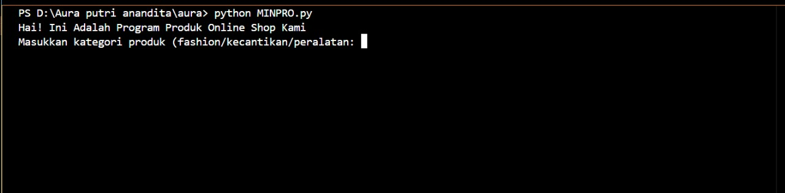
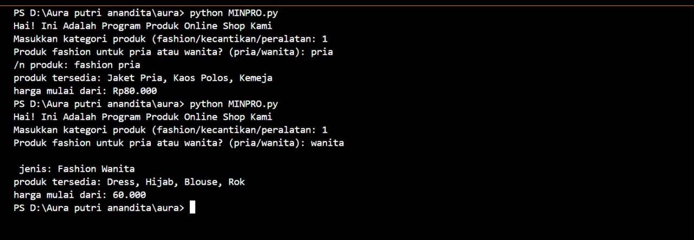
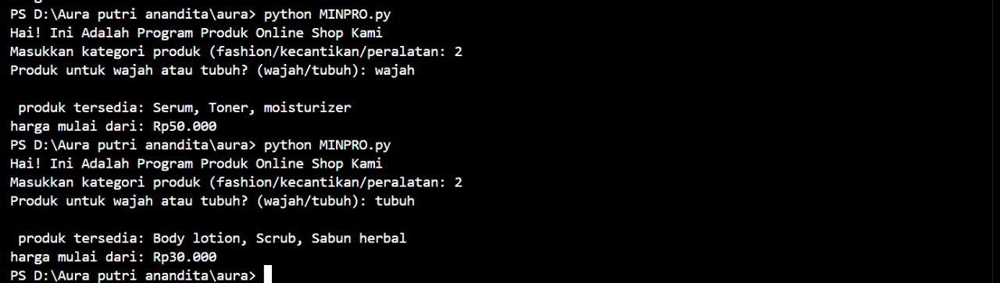
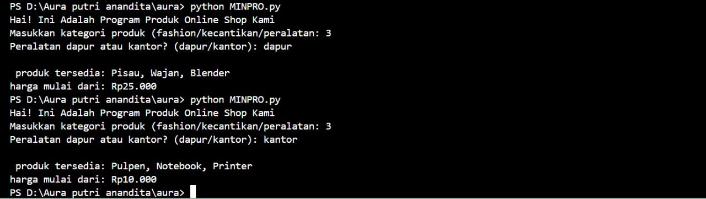

# Minpro 1 - Data Produk Online Shop

NAMA  : Aura Putri Anandita Syarif
 
NIM  : 2509116094
 
SISTEM INFORMASI (C)
 
 
<h2> Flowchart data produk online shop: </h2>

 
 
 

<h2> Output Menu </h2>

 Sistem meminta pengguna untuk mengetik salah satu kategori produk yang tersedia.

 •	Jika pengguna mengetik fashion, maka program mungkin akan menampilkan daftar produk fashion. 

 •	Jika mengetik kecantikan, program akan menampilkan produk kecantikan.

	•	Jika mengetik peralatan, maka yang muncul daftar produk peralatan.

<h2> Pilihan Pertama </h2>

1. User disuruh pilih kategori produk yang ada: bisa fashion, kecantikan, atau peralatan.

2.	Kalau pilih fashion, nanti ditanya lagi mau lihat produk buat:

pria atau wanita.

3.	Setelah itu, program langsung nampilin daftar produk sesuai pilihan user lengkap sama harga awalnya.

<h2> Pilihan Kedua </h2>

•	Jika user pilih kategori kecantikan, program bakal nanya lagi:

 produk buat wajah atau buat tubuh.

•	Jika wajah: muncul daftar seperti serum, toner, dan moisturizer (harga dari Rp50.000).

•	Jika tubuh: muncul daftar seperti body lotion, scrub, dan sabun herbal (harga dari Rp30.000). 

<h2> Pilihan Ketiga </h2>

•	Jika user pilih kategori peralatan, program akan nanya lagi:

 mau lihat peralatan dapur atau kantor?

•	Jika dapur: muncul pisau, wajan, blender (mulai Rp25.000).

•	Jika kantor: tampil pulpen, notebook, printer (mulai Rp10.000). 

